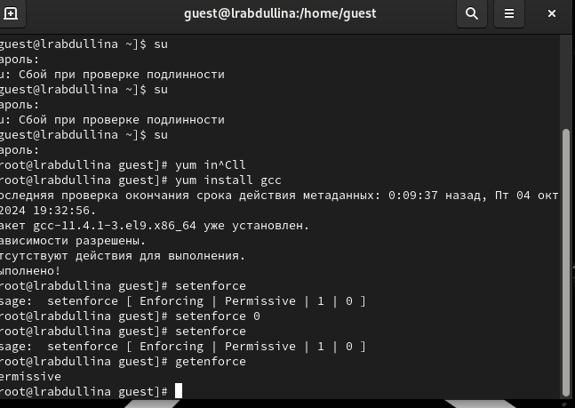
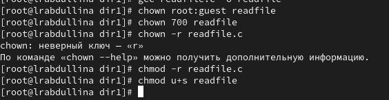

---
## Front matter
lang: ru-RU
title: Лабораторная работа №1
subtitle: 
author:
  - Абдуллина Ляйсан Раисовна
institute:
  - Российский университет дружбы народов, Москва, Россия
date: сентябрь 2024

babel-lang: russian
babel-otherlangs: english
mainfont: Arial
monofont: Courier New
fontsize: 12pt

## Formatting pdf
toc: false
toc-title: Содержание
slide_level: 2
aspectratio: 169
section-titles: true
theme: metropolis
header-includes:
 - \metroset{progressbar=frametitle,sectionpage=progressbar,numbering=fraction}
 - '\makeatletter'
 - '\beamer@ignorenonframefalse'
 - '\makeatother'
---

# Докладчик

:::::::::::::: {.columns align=center}
::: {.column width="70%"}

  * Абдуллина Ляйсан Раисовна
  * студентка НПИбд-01-21
  * Российский университет дружбы народов
  * [1032216538@pfur.ru](mailto:10322138@pfur.ru)
  * <https://AbdullinaLR.github.io/ru/>

:::
::: {.column width="30%"}

:::
::::::::::::::

# Цель работы

Целью данной работы является приобретение практических навыков
установки операционной системы на виртуальную машину, настройки минимально необходимых для дальнейшей работы сервисов.

# Выполнение лабораторной работы

{#fig:001 width=70%}

# Выполнение лабораторной работы

{#fig:002 width=70%}

# Выполнение лабораторной работы

{#fig:003 width=70%}

# Выполнение лабораторной работы

{#fig:004 width=70%}

# Выполнение лабораторной работы

{#fig:005 width=70%}

# Выполнение лабораторной работы

{#fig:006 width=70%}

# Выполнение лабораторной работы

{#fig:007 width=70%}

# Выполнение лабораторной работы

{#fig:008 width=70%}

# Выводы

Мы приобрели практических навыки установки операционной системы на виртуальную машину, настройки минимально необходимых для дальнейшей работы сервисов.

# Список литературы{.unnumbered}

1. https://rockylinux.org/ru/news/rocky-linux-9-0-ga-release

2. https://esystem.rudn.ru/mod/folder/view.php?id=1142104