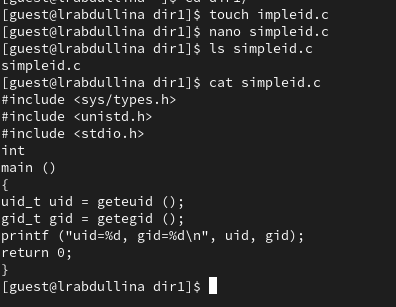
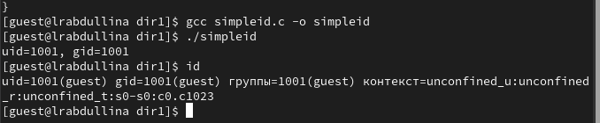
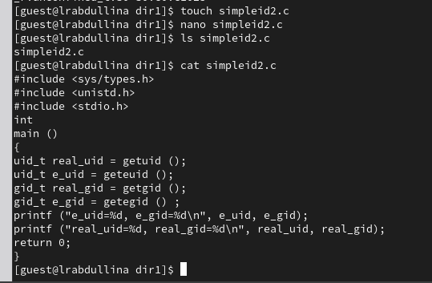

---
## Front matter
title: "Лабораторная работа №1"
subtitle: "Установка и конфигурация операционной системы на виртуальную машину"
author: "Абдуллина Ляйсан Раисовна, НПИбд-01-21"

## Generic otions
lang: ru-RU
toc-title: "Содержание"

## Bibliography
bibliography: bib/cite.bib
csl: pandoc/csl/gost-r-7-0-5-2008-numeric.csl

## Pdf output format
toc: true # Table of contents
toc-depth: 2
lof: true # List of figures
fontsize: 12pt
linestretch: 1.5
papersize: a4
documentclass: scrreprt
## I18n polyglossia
polyglossia-lang:
  name: russian
  options:
	- spelling=modern
	- babelshorthands=true
polyglossia-otherlangs:
  name: english
## I18n babel
babel-lang: russian
babel-otherlangs: english
## Fonts
mainfont: PT Serif
romanfont: PT Serif
sansfont: PT Sans
monofont: PT Mono
mainfontoptions: Ligatures=TeX
romanfontoptions: Ligatures=TeX
sansfontoptions: Ligatures=TeX,Scale=MatchLowercase
monofontoptions: Scale=MatchLowercase,Scale=0.9
## Biblatex
biblatex: true
biblio-style: "gost-numeric"
biblatexoptions:
  - parentracker=true
  - backend=biber
  - hyperref=auto
  - language=auto
  - autolang=other*
  - citestyle=gost-numeric

## Pandoc-crossref LaTeX customization
figureTitle: "Скриншот"
tableTitle: "Таблица"
listingTitle: "Листинг"
lofTitle: "Список иллюстраций"
lotTitle: "Список таблиц"
lolTitle: "Листинги"
## Misc options
indent: true
header-includes:
  - \usepackage{indentfirst}
  - \usepackage{float} # keep figures where there are in the text
  - \floatplacement{figure}{H} # keep figures where there are in the text
---

# Цель работы

Целью данной работы является приобретение практических навыков
установки операционной системы на виртуальную машину, настройки минимально необходимых для дальнейшей работы сервисов.

# Теоретическое введение

Лабораторная работа подразумевает установку на виртуальную машину VirtualBox (https://www.virtualbox.org/) операционной системы Linux (дистрибутив Rocky (https://rockylinux.org/)).
Выполнение работы возможно как в дисплейном классе факультета физико-математических и естественных наук РУДН, так и дома. Описание выполнения работы приведено для дисплейного класса со следующими характеристиками:

- Intel Core i3-550 3.2 GHz, 4 GB оперативной памяти, 20 GB свободного
места на жёстком диске;
- ОС Linux Gentoo (http://www.gentoo.ru/);
- VirtualBox верс. 6.1 или старше;
- каталог с образами ОС для работающих в дисплейном классе:
/afs/dk.sci.pfu.edu.ru/common/files/iso/.

# Выполнение лабораторной работы

Создайте новую виртуальную машину. Для этого в VirtualBox выберите Машина Создать. Укажите имя виртуальной машины (ваш логин в дисплейном классе), тип операционной системы — Linux, RedHat ([-@fig:001], [-@fig:002]).

{#fig:001 width=70%}

{#fig:002 width=70%}

Укажите размер основной памяти виртуальной машины — 2048 МБ (или большее число, кратное 1024 МБ, если позволяют технические характеристики вашего компьютера). ([-@fig:003])

{#fig:003 width=70%}

Задайте конфигурацию жёсткого диска — загрузочный,VDI (BirtualBox Disk Image), динамический виртуальный диск. Задайте размер диска — 40 ГБ (или больше), его расположение.Выберите в VirtualBox для Вашей виртуальной машины Настройки Носители. ([-@fig:004])

{#fig:004 width=70%}

Добавьте новый привод оптических дисков и выберите образ операционной системы, например для работающих в дисплейных классах /afs/dk.sci.pfu.edu.ru/common/files/iso/Rocky-8.6-x86_64-dvd1.iso

Если вы работаете на собственной технике, то DVD-образ операционной системы под архитектуру вашего компьютера необходимо предварительно скачать с официального сайта. Запустите виртуальную машину, выберите English в качестве языка интерфейса и перейдите к настройкам установки операционной
системы. При необходимости скорректируйте часовой пояс, раскладку клавиатуры (рекомендуется добавить русский язык, но в качестве языка по умолчанию указать английский язык; задать комбинацию клавиш для переключения между раскладками клавиатуры — например Alt + Shift ). В разделе выбора программ укажите в качестве базового окружения Server with GUI , а в качестве дополнения — Development Tools. Отключите KDUMP. Место установки ОС оставьте без изменения. Включите сетевое соединение и в качестве имени узла укажите user.localdomain, где вместо user укажите имя своего пользователя в соответствии с соглашением об именовании. ([-@fig:005])

{#fig:005 width=70%}

Установите пароль для root и пользователя с правами администратора. После завершения установки операционной системы корректно перезапустите виртуальную машину  и примите условия лицензии. В VirtualBox оптический диск должен отключиться автоматически. ([-@fig:006])

{#fig:006 width=70%}

Войдите в ОС под заданной вами при установке учётной записью. В меню Устройства виртуальной машины подключите образ диска дополнений гостевой ОС, при необходимости введите пароль пользователяroot вашей виртуальной ОС. После загрузки дополнений нажмите Return или Enter и корректно перезагрузите виртуальную машину. ([-@fig:007])

{#fig:007 width=70%}

Дождитесь загрузки графического окружения и откройте терминал. В окне терминала проанализируйте последовательность загрузки системы, выполнив команду dmesg. Можно просто просмотреть вывод этой команды: dmesg | less ([-@fig:008])

{#fig:008 width=70%}

1. Версия ядра Linux (Linux version).
7.15.0-76-generic
2. Частота процессора (Detected Mhz processor).
2400 MHz
3. Модель процессора (CPU0).
*Intel Core i7-9750H
4. Объем доступной оперативной памяти (Memory available).
6 GB
5. Тип обнаруженного гипервизора (Hypervisor detected).
VMware*
6. Тип файловой системы корневого раздела.
ext4
7. Последовательность монтирования файловых систем.

# Контрольные вопросы

1. Какую информацию содержит учётная запись пользователя?

Она содержит имя пользователя, UID (идентификатор пользователя), GID (идентификатор группы), домашний каталог, оболочку по умолчанию и пароль.

2. Укажите команды терминала и приведите примеры:
– для получения справки по команде;
man <команда>
– для перемещения по файловой системе;
cd <каталог>
– для просмотра содержимого каталога;
ls
– для определения объёма каталога;
du -sh <каталог>
– для создания / удаления каталогов / файлов;
mkdir <каталог>, touch <файл>
rm <файл>, rmdir <каталог>
– для задания определённых прав на файл / каталог;
chmod <права> <файл>
– для просмотра истории команд.
history

3. Что такое файловая система? Приведите примеры с краткой характеристикой.

Это способ организации данных на диске. Примеры:

- ext4 — популярная для Linux, поддерживает большие файлы.

- NTFS — используется в Windows, поддерживает права доступа.

- FAT32 — универсальная, но ограничена размером файла в 4 ГБ.

4. Как посмотреть, какие файловые системы подмонтированы в ОС?
mount или df -h.

5. Как удалить зависший процесс?
`kill <PID>

# Выводы

Мы приобрели практических навыки установки операционной системы на виртуальную машину, настройки минимально необходимых для дальнейшей работы сервисов.

# Список литературы{.unnumbered}

1. https://rockylinux.org/ru/news/rocky-linux-9-0-ga-release

2. https://esystem.rudn.ru/mod/folder/view.php?id=1142104
